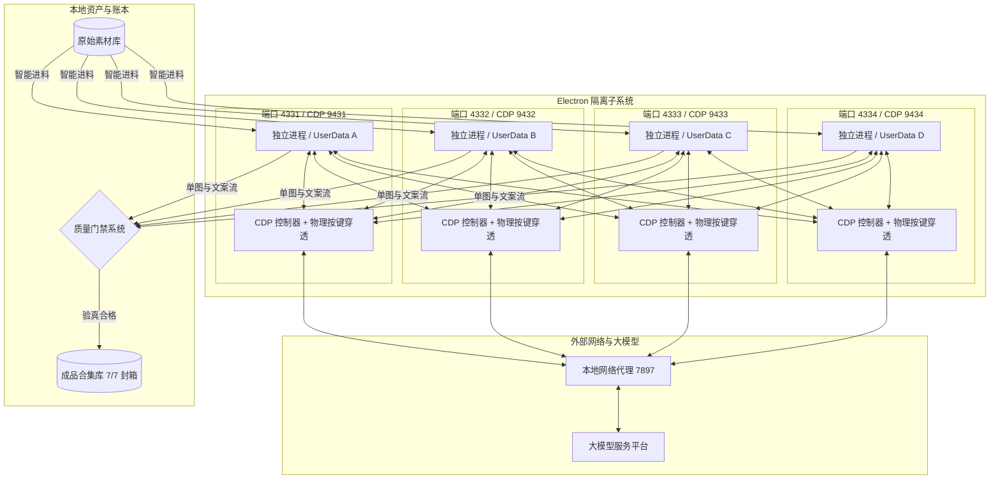

# AI 图文批量生产控制台

<p align="center">
  <strong>专为新媒体工业级矩阵打造的四核多实例、无人值守 AI 图文自动化生产中枢</strong><br>
  四核物理进程隔离 · CDP 物理按键穿透自愈 · 20MB 超大缓冲区防溢出 · 4K 级图文质量门禁
</p>

<p align="center">
  
  
  
  
  
</p>

---

## 🎯 痛点与初衷：为什么需要它？

在多账号、矩阵化自媒体内容工业化生产实践中，传统网页端操作和单脚本批量处理面临四大致命瓶颈：
1. **多账号串号与环境污染**：传统浏览器多开或多标签页共享相同或交叉的存储上下文，极易发生 Cookie 串扰、账号混淆，甚至触发平台的安全风控；
2. **长对话大 DOM 树导致连接闪退**：CDP 控制协议在读取数十轮上下文的长对话大页面时，默认缓冲区过小，极易抛出 `sent 1009 (message too big)` 异常导致生产进程骤然崩溃；
3. **断流假死与无头死等**：大模型在生成超长文案或批量图片时，若前端扩展偶发断流、停留在“等待输入 1 确认”时，常规脚本只能无限挂起，导致整个通宵的无人值守流水线全面瘫痪；
4. **下载损坏与图文脱节**：传统整包 ZIP 下载极易因网络波动损坏，且经常出现“只有图片没有文案”或“文案齐全却缺图”的次品事故。

**AI 图文批量生产控制台正是为彻底打通大规模生产断层而研发——以“四核物理进程隔离”、“底层 CDP 按键穿透自愈”、“20MB 防溢出管道”与“严密质量门禁”，实现 24 小时连续高产的工业级闭环。**

---

## 🌟 四大核心技术支柱

```
┌────────────────────────────────────────────────────────────────────────┐
│                        AI 图文批量生产控制台 核心矩阵                  │
├──────────────────┬──────────────────┬─────────────────┬────────────────┤
│  🚀 四核物理隔离 │  🛡️ 按键穿透自愈 │  📥 智能进料封箱│  💎 质量严密门禁│
│  A/B/C/D 四实例  │  底层 KeyCode 13 │  递归检索素材库 │  6+ 张 4K 大图 │
│  独立端口与会话  │  20MB WebSocket  │  7/7 满编自动进料│  哈希去重与文案│
│  互不串号故障熔断│  显式本地代理分流│  合集自动归档封箱│  坏卷毫秒级剔除│
└──────────────────┴──────────────────┴─────────────────┴────────────────┘
```

### 1. 🚀 四核物理级多实例隔离架构
* **进程与存储绝对隔离**：分为 A、B、C、D 四个完全独立的桌面子系统，分别绑定专属 HTTP 端口（4331–4334）与独立 CDP 调试端口（9431–9434）；
* **独立环境与用户数据**：每个实例独享物理 `userData` 存储路径与 Cookie 凭据，互不串号、互不干扰；单个实例的临时调试或故障重启绝不波及其他三个实例的连续生产。

### 2. 🛡️ 底层 CDP 物理按键穿透与连接自愈
* **物理级击发自愈**：当监测到模型完成上一阶段生成但前端扩展因事件丢失停留在确认阶段时，系统通过底层 Chrome 调试协议直接模拟真实的物理按键（WindowsVirtualKeyCode 13 回车）完成自动点火与状态推移，彻底消灭“卡死死等”；
* **20MB 超大 WebSocket 缓冲区**：彻底重构底层长连接通信通道，将默认缓冲区大幅扩容至 20MB，彻底终结长对话 DOM 树提取时的 `1009 (message too big)` 崩溃顽疾；
* **精准代理与本地分流**：外网请求精准调度至本地代理服务（7897），本地 API 与调试端口强制直连，网络链路 100% 畅通稳定。

### 3. 📥 全自动智能进料与满编封箱
* **素材库递归穿透检索**：自动递归扫描全量客资素材库，智能提取未排产的原图选题，自动注入提示词流水线；
* **合集自愈闭环与自动封箱**：实时监控各合集生产进度，精准达成 7/7 满编后立即自动封箱归档，并无缝进入下一编号合集继续生产，真正实现“通宵无人值守”。

### 4. 💎 工业级质量门禁与 4K 原图直存
* **单图直存零损耗**：告别容易坏包的压缩包下载模式，采用全自动 4K 原图直接落盘与双端成稿文案毫秒级解析配对；
* **四重严密质量检测**：每套作品必须通过“文件哈希去重”、“$\ge 6$ 张高清实景图完整度”、“双端文案结构性解析”与“坏卷自动熔断”四重门禁，确保产出成品的达标率达到 100%。

---

## 🚀 极简启动与协同

```mermaid
graph LR
    A[实例 A (端口 4331)] & B[实例 B (端口 4332)] & C[实例 C (端口 4333)] & D[实例 D (端口 4334)]
    A & B & C & D --> E[独立 CDP 驱动与自愈]
    E --> F[共享素材进料]
    F --> G[4K 原图与文案产出]
    G --> H[质量门禁 7/7 封箱]
```

### 1. 独立启动指定生产实例
你可以根据当前硬件负荷与账号规划，单独拉起任意一个或多个实例：
```powershell
# 启动实例 A（账号 1，管理端口 4331，CDP 9431）
.\start-instance-a.ps1

# 启动实例 B（账号 2，管理端口 4332，CDP 9432）
.\start-instance-b.ps1

# 启动实例 C（账号 3，管理端口 4333，CDP 9433）
.\start-instance-c.ps1

# 启动实例 D（账号 4，管理端口 4334，CDP 9434）
.\start-instance-d.ps1
```

### 2. 实时生产状态查看
每个实例启动后，可直接通过浏览器访问其独立管理页面：
- 实例 A 控制台：`http://127.0.0.1:4331`
- 实例 B 控制台：`http://127.0.0.1:4332`
- 实例 C 控制台：`http://127.0.0.1:4333`
- 实例 D 控制台：`http://127.0.0.1:4334`

各实例页面提供实时的生产进度、页面状态预览、检查点查看与手动调试干预入口。

---

## 🏗️ 系统拓扑架构



---

## ❓ 常见问题解答

### Q1: 为什么要采用多进程独立实例，而不是单窗口内开 4 个标签页？
在 Chromium 架构中，单进程内的多个标签页共享同一渲染管线与事件循环，一旦某个标签页因长会话造成内存泄漏或崩溃，会导致所有正在生产的标签页全军覆没。此外，不同账号登录态必须完全隔离，四进程独立模型在系统资源充足的情况下具备最顶级的健壮性。

### Q2: 生产过程中遇到网络抖动怎么办？
系统具备多层重试与自愈机制：首先通过本地代理隧道保持连接稳定；其次针对通信管道设定了心跳检测与重连逻辑；若出现断流，系统会触发物理级按键点火推进会话，无需人工在深夜值守排查。

### Q3: 生产完成的作品存放在哪里？
每套作品经质量门禁校验合格后，会自动保存至对应合集目录中，包含完整的 4K 原图文件与配对的文案文件，并由去重账本登记，防止后续环节混淆。

### Q4: 详细的版本历史与技术演进细节在哪里？
完整的版本变更纪要与生产优化历程请查阅 [`CHANGELOG.md`](CHANGELOG.md)。

---

## 📄 开源与商业许可

本项目遵循 [MIT 开源许可证](LICENSE)。
